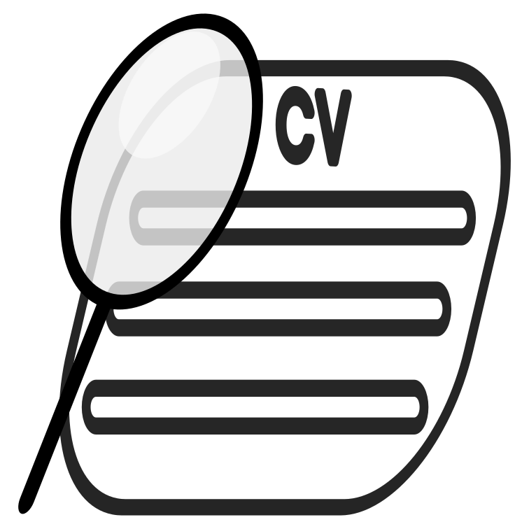

  

  
  
  
  
  
  
  

Resume Evaluator is a project I created which evaluate your resume and give you the following feedback:
<ul>
  <li>CV ATS score</li>
  <li>Main skill points</li>
  <li>Suggestions to improve the currect CV uploaded and reasons why these chages will improve it</li>
  <li>Job postings related to the job you are looking for and relevant location(country)</li>
</ul>
